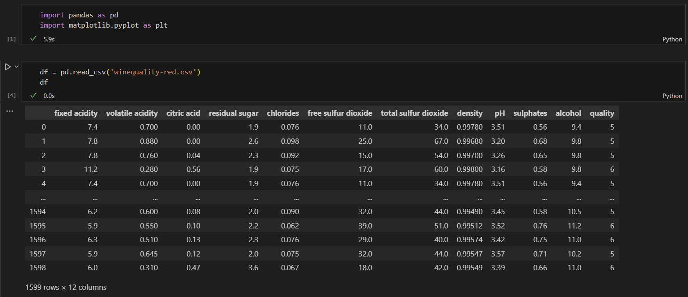
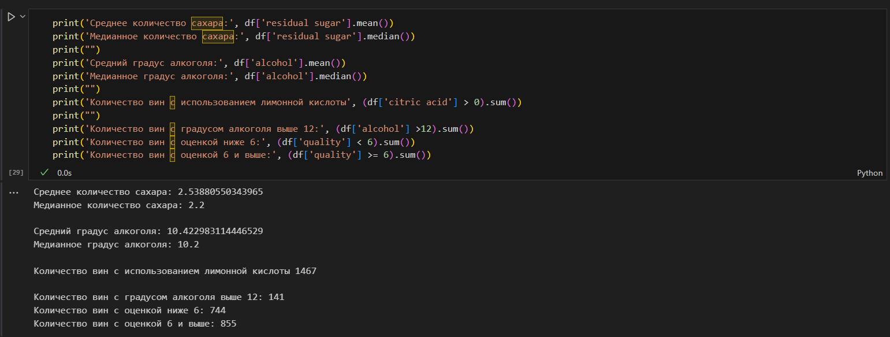
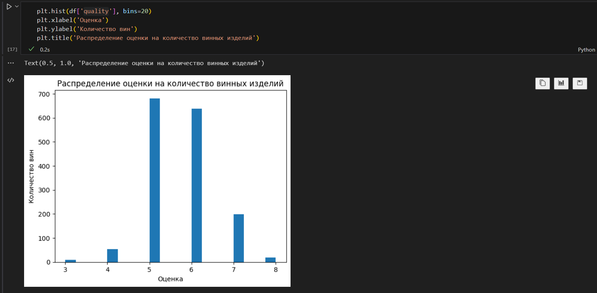
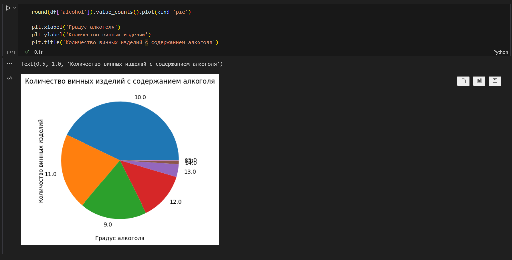
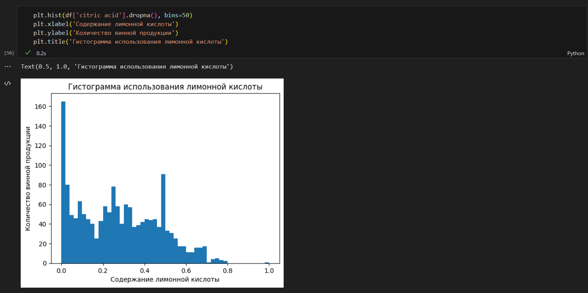

<p align = "center">МИНИСТЕРСТВО НАУКИ И ВЫСШЕГО ОБРАЗОВАНИЯ<br>
РОССИЙСКОЙ ФЕДЕРАЦИИ<br>
ФЕДЕРАЛЬНОЕ ГОСУДАРСТВЕННОЕ БЮДЖЕТНОЕ<br>
ОБРАЗОВАТЕЛЬНОЕ УЧРЕЖДЕНИЕ ВЫСШЕГО ОБРАЗОВАНИЯ<br>
«САХАЛИНСКИЙ ГОСУДАРСТВЕННЫЙ УНИВЕРСИТЕТ»</p>
<br><br><br><br><br><br>
<p align = "center">Институт естественных наук и техносферной безопасности<br>Кафедра информатики<br>Хроменков Владимир Александрович</p>
<br><br><br>
<p align = "center"><br>pandas, matplotlib»<br>01.03.02 Прикладная математика и информатика</p>
<br><br><br><br><br><br><br><br><br><br><br><br>
<p align = "right">Научный руководитель<br>
Лоскутов Артём Владимирович</p>
<br><br><br>
<p align = "center">г. Южно-Сахалинск<br>2023 г.</p>
<br><br><br><br><br><br><br><br>

## Задачи:

Найти любой источник данных в интернете, загрузить с помощью pandas, посчитать основные статистики, построить произвольные графики в matplotlib. 

## Решение:

Выбрал датасет с ингридиентами и химическим составом винных изделий (анонимно)

<div align="center">
    
    
    
    
    
</div>

## lab.ipynb:

```py
import pandas as pd
import matplotlib.pyplot as plt


df = pd.read_csv('winequality-red.csv')
df


print('Среднее количество сахара:', df['residual sugar'].mean())
print('Медианное количество сахара:', df['residual sugar'].median())
print("")
print('Средний градус алкоголя:', df['alcohol'].mean())
print('Медианное градус алкоголя:', df['alcohol'].median())
print("")
print('Количество вин с использованием лимонной кислоты', (df['citric acid'] > 0).sum())
print("")
print('Количество вин с градусом алкоголя выше 12:', (df['alcohol'] >12).sum())
print('Количество вин с оценкой ниже 6:', (df['quality'] < 6).sum())
print('Количество вин с оценкой 6 и выше:', (df['quality'] >= 6).sum())


plt.hist(df['quality'], bins=20)
plt.xlabel('Оценка')
plt.ylabel('Количество вин')
plt.title('Распределение оценки на количество винных изделий')


round(df['alcohol']).value_counts().plot(kind='pie')
plt.xlabel('Градус алкоголя')
plt.ylabel('Количество винных изделий')
plt.title('Количество винных изделий с содержанием алкоголя')


plt.hist(df['citric acid'].dropna(), bins=50)
plt.xlabel('Содержание лимонной кислоты')
plt.ylabel('Количество винной продукции')
plt.title('Гистограмма использования лимонной кислоты')

```

